<p align="center">
<a href="https://g1455.plugfox.dev">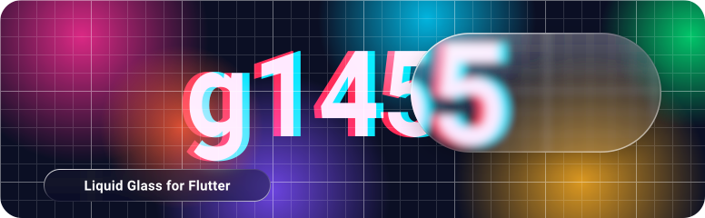</a>
</p>

<p align="center">
<a href="https://pub.dev/packages/g1455"></a>
<a href="https://pub.dev/packages/g1455/score"></a>
<a href="https://pub.dev/packages/g1455/score"></a>
<a href="https://pub.dev/packages/g1455/score"></a>
<br>
<a href="https://github.com/PlugFox/g1455/actions/workflows/checks.yml"></a>
<a href="https://codecov.io/gh/PlugFox/g1455"></a>
<a href="https://docs.flutter.dev/release/archive"></a>
<a href="https://pub.dev/packages/flutter_lints"></a>
<a href="LICENSE"></a>
</p>

<p align="center">
<b><a href="https://g1455.plugfox.dev">Live site</a></b>
&nbsp;·&nbsp;
<b><a href="https://pub.dev/documentation/g1455/latest/g1455/">API reference</a></b>
&nbsp;·&nbsp;
<b><a href="CHANGELOG.md">Changelog</a></b>
&nbsp;·&nbsp;
<b><a href="https://github.com/PlugFox/g1455/issues">Issues</a></b>
</p>

Liquid Glass for Flutter: refraction, blur, tint and a rim over the live
backdrop, in the shape the engine already draws (`RSuperellipse`). Built for
cost first. Features come second.

The name is *glass*, spelled in digits.

> [!NOTE]
> **Status: 0.x.** The API will still change between minor versions; every
> change is in the [changelog](CHANGELOG.md).

<!-- A whole screen first: glass in an app, not on a stage. 360 px wide, as a
     tile, so it shrinks to a phone's column the same way. -->
<p align="center">
<a href="https://g1455.plugfox.dev">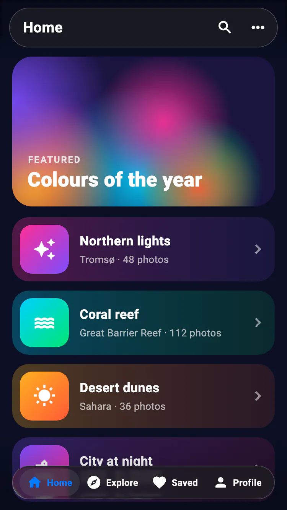</a>
</p>

<!-- Two tiles to a row: pub.dev draws a README 776 px wide, and two 360-px
     tiles with the space between them fit in it with room to spare, as on GitHub. On a
     narrower screen `max-width: 100%` shrinks each tile to the column and they
     wrap one to a row. Each tile opens its page on the site. -->
<p align="center">
<a href="https://g1455.plugfox.dev/foundations/groups">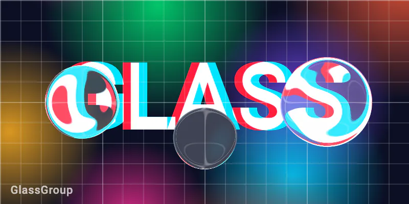</a>
<a href="https://g1455.plugfox.dev/foundations/finishes">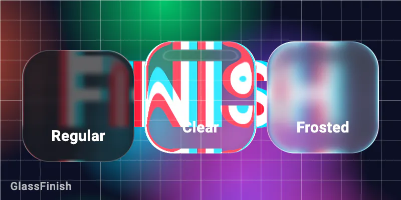</a>
<a href="https://g1455.plugfox.dev/foundations/ripple">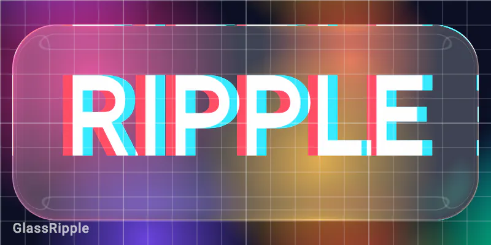</a>
<a href="https://g1455.plugfox.dev/foundations/surface">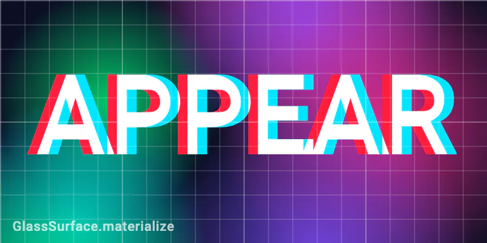</a>
<a href="https://g1455.plugfox.dev/components/switch">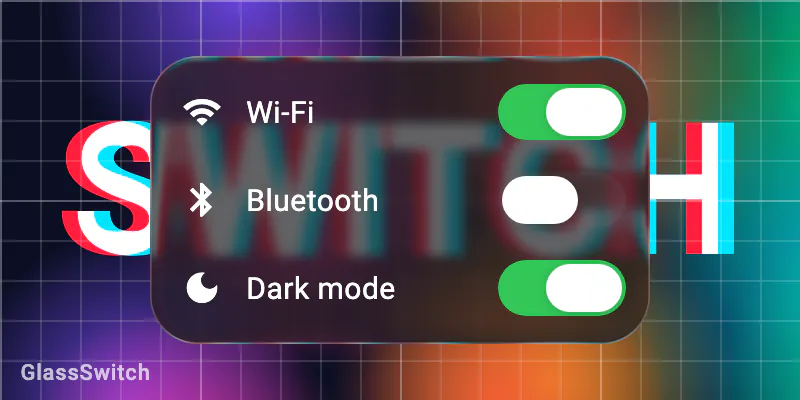</a>
<a href="https://g1455.plugfox.dev/components/slider">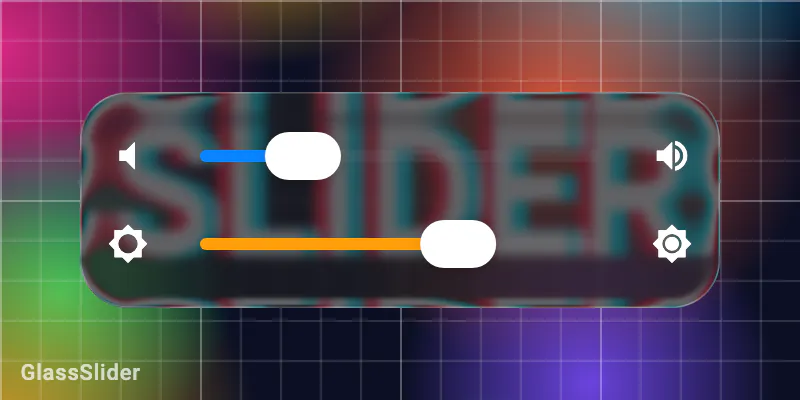</a>
<a href="https://g1455.plugfox.dev/components/tab-bar">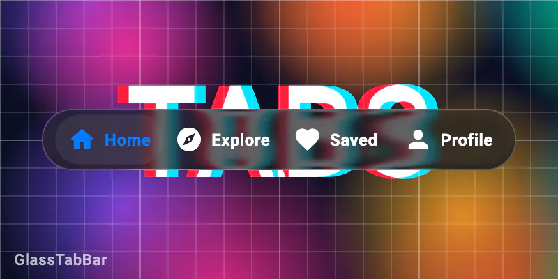</a>
<a href="https://g1455.plugfox.dev/components/segmented-control">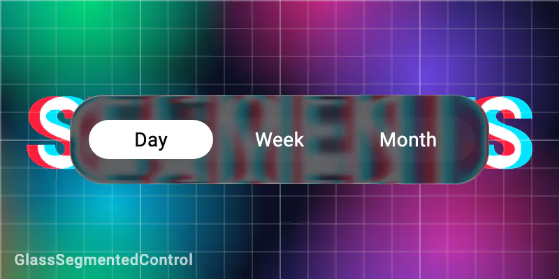</a>
<a href="https://g1455.plugfox.dev/components/menu">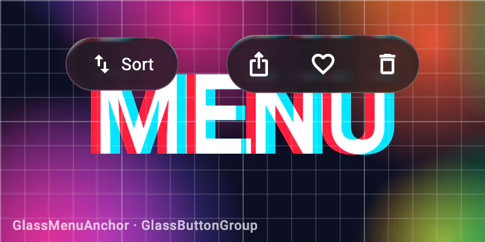</a>
<a href="https://g1455.plugfox.dev/components/alert">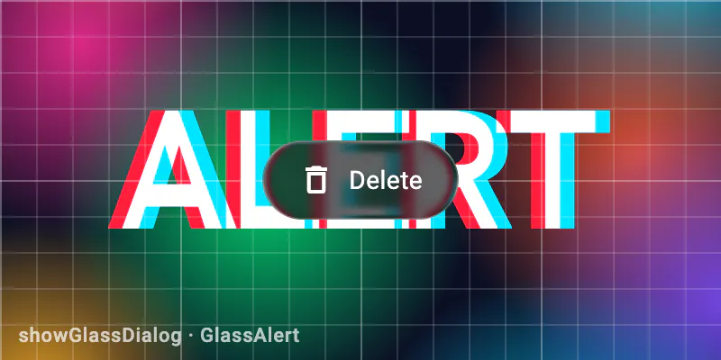</a>
</p>

<p align="center"><sub>
Every loop is rendered by the package itself, headless, from
<a href="example/showcase/"><code>example/showcase/</code></a>. The tiles are cut
from one backdrop, two to a row, and meet without a seam. Tap a tile for its page
on the site.
</sub></p>

## Contents

- [How it works](#how-it-works)
- [Install](#install)
- [Quick start](#quick-start)
- [What is in the box](#what-is-in-the-box)
- [Finishes](#finishes)
- [Common patterns](#common-patterns)
- [What is not here, and why](#what-is-not-here-and-why)
- [Things the application has to declare](#things-the-application-has-to-declare)
- [Platforms](#platforms)
- [Diagnostics](#diagnostics)
- [Development](#development)
- [Re-shooting the animations](#re-shooting-the-animations)
- [License](#license)

## How it works

Most glass packages put a `BackdropFilter` on every surface, which means the
engine reads the backdrop once per surface on every frame. This package takes a
different route:

<!-- Four 360-px cards, two to a row in pub.dev's 776-px column and one to a row
     on a phone, as the tiles above. Each is drawn by hand in doc/readme/ and
     opens its page on the site. The tables below carry the same facts as text. -->
<p align="center">
<a href="https://g1455.plugfox.dev/start/how-it-works"></a>
<a href="https://g1455.plugfox.dev/foundations/travel"></a>
<a href="https://g1455.plugfox.dev/start/how-it-works">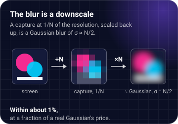</a>
<a href="https://g1455.plugfox.dev/foundations/performance">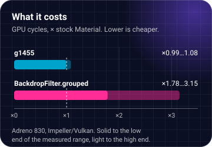</a>
</p>

| | |
|---|---|
| **One host, one capture** | A [`GlassHost`][GlassHost] records what is painted under all of its glass into one atlas, at a resolution picked against a measured quality budget. Every surface then samples its own slot of that atlas. |
| **A capture only when something changed** | The host walks the composited layer tree. When nothing under the glass changed, it keeps the proxy it already has. That covers a still screen, and a moving glass over content that stays put. Keeping the proxy is the default, and it is the biggest saving in the package: 79.4% and 66.3% of the route's added cost on Adreno, 97.8% on Metal. |
| **The blur is a downscale** | A 1/N proxy is a Gaussian of σ ≈ N/2 to within about 1%, at a fraction of the price of a real Gaussian. |

Measured costs, each on its own platform, because the platforms are not
comparable:

| platform | glass vs stock Material | engine `BackdropFilter.grouped` |
|---|---|---|
| Android, Impeller/Vulkan, Adreno 830 (GPU cycles) | ×0.99…1.08 | ×1.78…3.15 |
| iPad, Impeller/Metal (GPU ms, scrolling screen) | ×1.93…2.02, or ×1.46…1.54 with thermal throttling | — |

## Install

```bash
flutter pub add g1455
```

Requires Flutter 3.47 or later.

## Quick start

A whole app: a list of coloured tiles to refract, a bar over it and a tab bar
under it. Paste it over `lib/main.dart`.

```dart
import 'package:flutter/material.dart';
import 'package:g1455/g1455.dart';

void main() => runApp(const App());

class App extends StatelessWidget {
  const App({super.key});

  @override
  Widget build(BuildContext context) => MaterialApp(
    // The host goes above the navigator, so dialogs, sheets and menus are
    // under it as well as the screens.
    builder: (BuildContext context, Widget? navigator) => GlassHost(
      // The backdrop is a feed of colours rather than one flat colour: pick
      // the labels against any backdrop, and dim the glass if they need it.
      richBackdrop: true,
      minLabelContrast: kTextContrastAA,
      child: navigator!,
    ),
    home: const Home(),
  );
}

class Home extends StatefulWidget {
  const Home({super.key});

  @override
  State<Home> createState() => _HomeState();
}

class _HomeState extends State<Home> {
  int _tab = 0;

  @override
  Widget build(BuildContext context) => Scaffold(
    body: Stack(
      children: <Widget>[
        // What the glass refracts: coloured tiles, scrolling under both bars.
        ListView.builder(
          padding: const EdgeInsets.fromLTRB(16, 120, 16, 120),
          itemCount: 40,
          itemBuilder: (BuildContext context, int i) => Container(
            height: 96,
            margin: const EdgeInsets.only(bottom: 12),
            decoration: BoxDecoration(
              color: HSLColor.fromAHSL(1, i * 27.0 % 360, 0.7, 0.55).toColor(),
              borderRadius: BorderRadius.circular(20),
            ),
          ),
        ),
        const Positioned(
          top: 0,
          left: 16,
          right: 16,
          child: SafeArea(
            child: GlassBar(child: Text('Library')),
          ),
        ),
        Positioned(
          left: 16,
          right: 16,
          bottom: 0,
          child: SafeArea(
            child: GlassTabBar(
              items: const <GlassTabItem>[
                GlassTabItem(icon: Icons.photo_library_outlined, label: 'Library'),
                GlassTabItem(icon: Icons.favorite_border, label: 'For You'),
                GlassTabItem(icon: Icons.search, label: 'Search'),
              ],
              selectedIndex: _tab,
              onSelected: (int i) => setState(() => _tab = i),
            ),
          ),
        ),
      ],
    ),
  );
}
```

The host goes in `MaterialApp.builder`, above the navigator, rather than around
one screen: dialogs, sheets and menus are built in the navigator's overlay, and
a host below the navigator does not see them.

Every component is live at **[g1455.plugfox.dev](https://g1455.plugfox.dev)**,
with its guide, its code and its API. The site is the [`example/`](example/)
app built for the web: one host, every component on its own page, the original
full-screen demos, and a settings menu that switches the finish, the tint, the
rung and the ripple.

## What is in the box

Every name links to its page in the API reference.

### Foundations

| API | What it is |
|---|---|
| [`GlassHost`][GlassHost] | The one capture every glass below it samples. Takes what the application declares: `backdrop`, `hardware`, `thermal`, `highContrast`, `ripple`. `GlassHost.precache()` in `main()` compiles the shaders before the first frame. |
| [`GlassSurface`][GlassSurface] | The primitive: a region of the screen that is glass, with a corner radius, an optional finish, and `presence` / `materialize` for appearing. |
| [`GlassFinish`][GlassFinish] | The optics: `.regularDark`, `.regularLight`, `.clear` and `.frosted`, calibrated against Apple's own materials on iOS 26. Apple's `.regular` is two materials, dark over dark content and light over light, and `GlassHost` picks the branch the same way unless you name one: from `backdrop` and the platform's appearance. |
| [`GlassTheme`][GlassTheme] · [`GlassThemeData`][GlassThemeData] | The tokens a screen's glass reads: the finish every surface wears unless it names its own, the rung, the label floor. |
| [`GlassRipple`][GlassRipple] | Optional, and not Apple's. A viscous wave from the touch: a dimple under the finger, a front that travels out, a spring-back on release. `viscosity` goes from water (0) to honey (1). Declare it on `GlassHost.ripple` for every surface, or on `GlassSurface.ripple` for one. A wave takes no capture and repaints nothing; off under reduced motion. |
| [`GlassAdaptive`][GlassAdaptive] | Optional: glass that reads its own backdrop. Each bar, card and button picks the branch of `.regular` and its label from the mean level of the capture under it, instead of from `backdrop`. Off by default and free when off; on, a small read-back per capture, at most once per `interval` (250 ms, a second on the web), behind a band and a hold. |
| [`GlassDropMotion`][GlassDropMotion] | How the held drop of the switch, slider, segmented control and tab bar stretches as it sets off and squashes as it stops. On and subtle by default, because it costs no capture; `GlassDropMotion.none` turns it off, and so does reduced motion. Declare it on `GlassHost`, the theme or one control. |

### Panels and controls

| API | What it is |
|---|---|
| [`GlassBar`][GlassBar] · [`GlassButton`][GlassButton] · [`GlassCard`][GlassCard] | Panels with a label colour chosen for legibility. |
| [`GlassSwitch`][GlassSwitch] · [`GlassSlider`][GlassSlider] | Controls whose knob turns into a clear drop while held. |
| [`GlassTabBar`][GlassTabBar] · [`GlassSegmentedControl`][GlassSegmentedControl] | The selection lifts into a drop that can be dragged between items. A tab's icon and label can be any widget, through `iconBuilder` and `labelBuilder`. |
| [`GlassButtonGroup`][GlassButtonGroup] | A toolbar capsule of icon buttons ([`GlassToolbarItem`][GlassToolbarItem]). |
| [`GlassTextField`][GlassTextField] | A single line of text in a glass capsule. |
| [`GlassScrollEdge`][GlassScrollEdge] | The scroll edge effect under a bar, and the bar. |
| [`GlassScaffold`][GlassScaffold] | A screen wired as this README recommends: a host when none is above, a top bar in a soft scroll edge, an optional bottom bar and floating action, and a body that scrolls under the bars. |

### Modals

| API | What it is |
|---|---|
| [`showGlassDialog`][showGlassDialog] · [`GlassAlert`][GlassAlert] | An alert that materializes over the screen, blur first and tint last. |
| [`showGlassSheet`][showGlassSheet] | A glass sheet from the bottom edge. |
| [`GlassMenuAnchor`][GlassMenuAnchor] · [`GlassPopoverAnchor`][GlassPopoverAnchor] | A menu, or a panel of any content, that grows out of its anchor. |

Glass appears and leaves through `GlassSurface.materialize`: the bend, the blur
and the tint arrive over the whole shape. `presence` erodes the shape and is for
budding inside a `GlassGroup`; on a lone panel it narrows to a line.

### Composition

| API | What it is |
|---|---|
| [`GlassGroup`][GlassGroup] · [`GlassUnion`][GlassUnion] | Several surfaces drawn as one silhouette, fusing where they meet. |
| [`GlassTravel`][GlassTravel] | Declares the region a moving glass travels in, so the motion does not trigger a capture. |
| [`GlassMorph`][GlassMorph] | Swap the child and the glass flows to its size, the way a button becomes its menu. A neck forms while it grows; at rest it is one plain surface. |
| [`GlassAbove`][GlassAbove] | Raises the glass below it a level above the glass beside it: a bar over glass cards sees the cards. |

### Policy and accounting

| API | What it is |
|---|---|
| [`GlassTier`][GlassTier] · [`GlassTierPolicy`][GlassTierPolicy] | Pick the rung: full glass, a flat translucent fill, or opaque. Use it for reduce transparency, low-end devices and thermal pressure. |
| [`GlassLedger`][GlassLedger] | Reports how much glass is on the screen and what it costs. |
| [`GlassHardware`][GlassHardware] · [`GlassThermalState`][GlassThermalState] | What the application declares about the device. |

The whole library is at
[pub.dev/documentation/g1455](https://pub.dev/documentation/g1455/latest/g1455/).

## Finishes

A finish is what the glass does to the light it lets through. The four presets,
every number as `GlassFinish` holds it:

| Finish | Blur σ, px | Tint, RGB | Tint alpha | Rim adds, of 255 | Bend at the rim, px | Falloff with depth u, px | Magnification |
|---|---|---|---|---|---|---|---|
| `.regularDark` | 2.6 | 29, 29, 32 | 0.693 | 50.2 | -58.2 | (1 - (u/21)^0.6)^1.9 | 1 |
| `.regularLight` | 2.6 | 252, 252, 252 | 0.718 | 50.2 | -58.2 | (1 - (u/21)^0.6)^1.9 | 1 |
| `.clear` | 0 | 249, 249, 249 | 0.22 | 50.2 | -58.2 | (1 - (u/21)^0.6)^1.9 | 1 |
| `.frosted` | 8 | 249, 249, 249 | 0.22 | 50.2 | -58.2 | (1 - (u/21)^0.6)^1.9 | 1 |

- **Blur** is the sigma applied to the capture before it is sampled, in
  logical pixels.
- **Tint** is laid over the refracted sample as `mix(sample, tint, alpha)`, so
  `1 - alpha` of the backdrop comes through: 0.307 of it under
  `.regularDark`, 0.282 under `.regularLight`. `.regular` is dark because it
  barely transmits the backdrop, not because it lays something dark over it.
- **Rim** is a white outline 0.79 px wide that adds to what is under it rather
  than mixing over it, and has no light direction.
- **Bend** is how far a sample is pulled at the rim; negative is inward. It
  falls to nothing 21 px in from the edge along the falloff curve.
- **Magnification** is 1 for every finish. What magnifies is the tab bar's
  held drop, by `kGlassTabDropZoom` (1.17), as iOS's does.

`.regularDark` and `.regularLight` are the two branches of Apple's `.regular`,
which is dark over a dark backdrop and light over a light one.
`GlassFinish.regular(appearance:, backdrop:)` picks the branch, and `GlassHost`
calls it unless a finish is named. `.clear` and `.frosted` differ only in blur.
`.frosted` is a heavy blur kept under its old name: scored against Apple's
material, it is a `UIVisualEffectView` blur rather than Liquid Glass.

A finish of your own is a `GlassFinish(...)` or a `copyWith` of a preset. The
package's damage tables are keyed by the four names above, so a finish under
another name gets no measured price.

## Common patterns

Each snippet assumes a `GlassHost` above it, as in the quick start.

### Glass over a scrolling list

The commonest screen there is, and the case the capture is built for: a frame
the list moves is one capture for all the glass on the screen, and a frame it
rests is none. For iOS's soft edge under the bar, put the bar in a
[`GlassScrollEdge`][GlassScrollEdge].

```dart
class Feed extends StatelessWidget {
  const Feed({super.key});

  @override
  Widget build(BuildContext context) => Stack(
    children: <Widget>[
      // A frame the list moves is one capture for every glass on the screen;
      // a frame it rests is none.
      ListView.builder(
        padding: const EdgeInsets.only(top: 96),
        itemCount: 100,
        itemBuilder: (BuildContext context, int i) => ListTile(title: Text('Message $i')),
      ),
      const Positioned(
        top: 0,
        left: 16,
        right: 16,
        child: SafeArea(
          child: GlassBar(child: Text('Inbox')),
        ),
      ),
    ],
  );
}
```

### Moving glass inside a `GlassTravel`

Glass that moves over still content would otherwise be captured on every frame
it moves, because its slot in the capture is its own box. `GlassTravel` makes
the slot the whole region, so the drag costs no capture. The content under it
goes behind its own `RepaintBoundary`, and so does the moving glass: a repaint
under the glass counts as changed content. The switch, slider, segmented
control and tab bar already do this for their drops.

```dart
class Lens extends StatefulWidget {
  const Lens({super.key});

  @override
  State<Lens> createState() => _LensState();
}

class _LensState extends State<Lens> {
  Offset _at = const Offset(100, 100);

  @override
  Widget build(BuildContext context) => Stack(
    children: <Widget>[
      // What the lens moves over, behind its own boundary: the drag repaints
      // none of it.
      const Positioned.fill(
        child: RepaintBoundary(child: FlutterLogo(style: FlutterLogoStyle.stacked)),
      ),
      // The lens may go anywhere in here, and the host captures all of it
      // once: dragging the lens over still content takes no capture.
      Positioned.fill(
        child: GlassTravel(
          child: RepaintBoundary(
            child: Stack(
              children: <Widget>[
                Positioned(
                  left: _at.dx - 48,
                  top: _at.dy - 48,
                  width: 96,
                  height: 96,
                  child: GestureDetector(
                    onPanUpdate: (DragUpdateDetails d) => setState(() => _at += d.delta),
                    child: const GlassSurface(
                      borderRadius: kGlassCapsule,
                      finish: GlassFinish.clear,
                      labelled: false,
                      child: SizedBox.expand(),
                    ),
                  ),
                ),
              ],
            ),
          ),
        ),
      ),
    ],
  );
}
```

### Glass on glass

A bar over a list of glass cards is the cards' sibling, and by default it sees
the page with the cards cut out. `GlassAbove` raises it a level, so it refracts
the cards. A level costs one more snapshot on a frame that captures, and nothing
when there is no glass under the lifted one.

```dart
class Cards extends StatelessWidget {
  const Cards({super.key});

  @override
  Widget build(BuildContext context) => Stack(
    children: <Widget>[
      ListView(
        padding: const EdgeInsets.fromLTRB(16, 96, 16, 16),
        children: <Widget>[
          for (int i = 0; i < 20; i++)
            Padding(
              padding: const EdgeInsets.only(bottom: 12),
              child: GlassCard(child: Text('Card $i')),
            ),
        ],
      ),
      // The bar is the cards' sibling, not their parent. Without GlassAbove
      // it would show the page with the cards cut out of it; with it, the bar
      // is a level above them and refracts them.
      const Positioned(
        top: 0,
        left: 16,
        right: 16,
        child: SafeArea(
          child: GlassAbove(child: GlassBar(child: Text('Cards'))),
        ),
      ),
    ],
  );
}
```

### A menu or a dialog over a bar

Both are built in the navigator's overlay, so the host has to be above the
navigator: `MaterialApp(builder: (context, navigator) => GlassHost(child: navigator!))`.
The package's own modals are already lifted above the bars.

```dart
class NotesBar extends StatelessWidget {
  const NotesBar({super.key});

  @override
  Widget build(BuildContext context) => GlassBar(
    child: Row(
      children: <Widget>[
        const Expanded(child: Text('Notes')),
        GlassMenuAnchor(
          items: <GlassMenuItem>[
            GlassMenuItem(label: 'Delete all', isDestructive: true, onPressed: () => _confirm(context)),
          ],
          builder: (BuildContext context, GlassMenuController menu) => GlassButton(
            onPressed: menu.open,
            semanticLabel: 'More',
            padding: EdgeInsets.zero,
            child: const Icon(Icons.more_horiz),
          ),
        ),
      ],
    ),
  );

  Future<void> _confirm(BuildContext context) => showGlassDialog<void>(
    context: context,
    builder: (BuildContext context) => GlassAlert(
      title: const Text('Delete all notes?'),
      actions: <GlassAlertAction>[
        GlassAlertAction(label: 'Cancel', isDefault: true, onPressed: () => Navigator.pop(context)),
        GlassAlertAction(label: 'Delete', isDestructive: true, onPressed: () => Navigator.pop(context)),
      ],
    ),
  );
}
```

### The cheap rung

`GlassTier.cheap` draws the tint over the backdrop and captures nothing. The
package sets no ceiling itself, because whether a screen can afford full glass
is a fact about the application's frame. The application decides, and declares
it. Reduce transparency gives `GlassTier.opaque`, a solid fill matched to the
glass over the declared `backdrop`.

```dart
MaterialApp(
  builder: (BuildContext context, Widget? navigator) => GlassHost(
    backdrop: Colors.white, // what the opaque rung fills to match
    tier: GlassTierPolicy(
      reduceTransparency: reduceTransparency, // read natively by the app
      ceiling: lowEndDevice ? GlassTier.cheap : null, // the app's own benchmark or device table
    ).choose(),
    child: navigator!,
  ),
  home: const Scaffold(body: Feed()),
)
```

To put one part of a screen on another rung, wrap it in a `GlassTheme` with a
`tier` of its own.

## What is not here, and why

- **Dispersion, or chromatic aberration.** Apple's material sends the red,
  green and blue channels to the same place, to within 0.155 logical px
  against a measurement floor of 0.457. One sample per pixel is what the
  reference does, not a shortcut, and a dispersion effect would be a departure
  from it.
- **Shapes other than `RSuperellipse`.** Every surface is a `BorderRadius`
  drawn as the engine's round superellipse, the shape a
  `RoundedRectangleBorder` already lowers to and the continuous corner Apple's
  material has. A plain rounded rectangle is not a substitute: the curvature
  jumps where its straight side meets the arc, and the rim's shading would show
  the jump. The refraction is an analytic distance to that one shape, with one
  corner radius per surface, so four different corners, a star or an arbitrary
  path are not drawn. A capsule is a radius larger than the box,
  [`kGlassCapsule`](https://pub.dev/documentation/g1455/latest/g1455/kGlassCapsule-constant.html).

## Things the application has to declare

The package cannot work some things out from the render tree, so the
application declares them:

- **What is behind the glass**, for label legibility: `GlassHost.backdrop` for
  a flat colour, or `richBackdrop: true` with `minLabelContrast` for an image or
  a scrolling feed. Without either, labels are picked against the worst case,
  and in debug the package warns when a finish cannot be read over it.
  Or let bars, cards and buttons read it: `GlassHost(adaptive: GlassAdaptive())`
  measures the capture under each of them, for a small read-back per capture.
- **Reduce transparency, increase contrast on macOS, and thermal state.**
  Flutter does not pass these on, and this package ships no platform code to
  read them. Read them natively and pass them in: reduce transparency to
  `GlassTierPolicy`, contrast to `GlassHost.highContrast`, thermal state to
  `GlassHost.thermal` as a `GlassThermalState`. On iOS and Android 34+ the
  host already reads contrast from `MediaQuery`. On macOS the engine does not
  pass it on.
- **The hardware family**, if it is not an Apple device: `GlassHost.hardware`.
  Undeclared hardware gets the same behaviour with no price attached.

## Platforms

| Renderer | Where | Status |
|---|---|---|
| Impeller — Metal | iOS, macOS | ✅ |
| Impeller — Vulkan | Android | ✅ |
| Impeller — GLES | Android | ✅ |
| Skia — GLES | Android below API 29, Vivante GPUs | ✅ |
| Skwasm | Web | ✅ |
| CanvasKit | Web | ✅, slow; see below |

The route renders byte-identically on all of them. Every bundled shader is
compiled for all five shader targets in `test/shader_targets_test.dart`, so a
shader that SkSL would reject fails the tests rather than a user's app.

> [!WARNING]
> **On the web, outside Chromium, the glass is slow.** Every capture of the
> backdrop goes through `Picture.toImageSync`. On CanvasKit that call reads
> the pixels back from the GPU and waits for them. On the same machine, an
> M3 Max, a frame of full glass took 15 to 30 ms on CanvasKit and 4 to 10 ms on
> Skwasm. On a phone CanvasKit is well past a 60 Hz frame.
>
> Flutter's loader picks Skwasm only in Chromium browsers (Chrome, Edge,
> Opera, Brave and others) unless the app allows more. Safari, Firefox and
> **every browser on iOS, Chrome for iOS included** (they all run WebKit)
> get dart2js and CanvasKit. Two things help:
>
> - Build with `flutter build web --wasm` and allow Skwasm on WebKit as well:
>   `_flutter.loader.load({config: {wasmAllowList: {webkit: true}}})`. Test it
>   on the devices you ship to. Flutter leaves WebKit off by default, and
>   Skwasm on WebKit still costs about twice what it costs in Chromium.
> - Where the app still runs on CanvasKit (`kIsWeb && !kIsWasm`), declare a
>   cheaper rung: `GlassTierPolicy(ceiling: GlassTier.cheap)` draws the tint
>   over the backdrop and captures nothing, and the two renderers are level
>   there. The example site opens that way on CanvasKit and says so.

## Diagnostics

[`package:g1455/glass_diagnostics.dart`](https://pub.dev/documentation/g1455/latest/glass_diagnostics/)
exposes the switches a benchmark flips, such as the tile split of a group's draw
and the anti-alias flag. It also exposes the host's proxy handle, whose counters
show whether a frame captured. An application has no reason to import it.

## Development

```bash
flutter pub get
dart format .
flutter analyze --fatal-infos
flutter test --coverage
(cd example && flutter test test/ showcase/)
```

`dart format` takes its width (120) and its trailing-comma rule from
`analysis_options.yaml`, and CI fails on a file it would change.

Some tests check a constant baked into `lib/` against the measurement it came
from. Those measurements are copied into `provenance/`, unchanged and under
their original file names. They live in the repository only; the published
package does not carry them.

A pull request runs the same checks in CI, plus `flutter pub publish --dry-run`
and pana. A release is a tag: bump `version` in `pubspec.yaml`, add its
`## <version>` section to `CHANGELOG.md`, and push `v<version>`. The tag
publishes to pub.dev and opens a GitHub release with that section as notes.

## Re-shooting the animations

```bash
tool/showcase.sh                  # every tile
tool/showcase.sh switch,tab_bar   # just these
tool/showcase.sh screen           # the whole screen at the top
```

The script plays each scene of `example/showcase/scenes.dart` under
`flutter test`, with a fake clock and scripted touches, so every run produces
the same frames and needs no device. It plays one loop to let springs and waves
settle and records the next, and it fails if the last frame does not lead back
into the first. It then packs the frames into looping webp files in
`doc/showcase/` with `cwebp` and `webpmux` (from libwebp: `brew install webp`),
each frame encoding only the rect that changed.

The whole screen at the top is `example/showcase/screen.dart`. It has its own
size and no shared backdrop, and it is not one of pub.dev's screenshots, so the
script shoots it only when it is named.

The screenshots pub.dev shows are the same loops at half the size, because pub
ships them with the package:

```bash
SHOWCASE_DPR=1 SHOWCASE_DIR=doc/screenshots tool/showcase.sh
```

A new scene is a `ShowcaseScene` in that list: a builder given the loop's phase
from 0 to 1, and `Stroke`s for the fingers. Scenes are cut from one backdrop in
list order, two to a row, so a scene's position in the list is its place in the
grid; keep the count even, and at most ten — as many screenshots as pub.dev
shows.

The banner at the top is [`doc/readme/banner.svg`](doc/readme/banner.svg),
drawn by hand over the same backdrop, and so are the four cards under
[How it works](#how-it-works), `doc/readme/how-*.svg`. Their numbers are copied
from the tables beside them; change both together.

## License

[MIT](LICENSE)

[GlassHost]: https://pub.dev/documentation/g1455/latest/g1455/GlassHost-class.html
[GlassAdaptive]: https://pub.dev/documentation/g1455/latest/g1455/GlassAdaptive-class.html
[GlassDropMotion]: https://pub.dev/documentation/g1455/latest/g1455/GlassDropMotion-class.html
[GlassScaffold]: https://pub.dev/documentation/g1455/latest/g1455/GlassScaffold-class.html
[GlassMorph]: https://pub.dev/documentation/g1455/latest/g1455/GlassMorph-class.html
[GlassSurface]: https://pub.dev/documentation/g1455/latest/g1455/GlassSurface-class.html
[GlassFinish]: https://pub.dev/documentation/g1455/latest/g1455/GlassFinish-class.html
[GlassTheme]: https://pub.dev/documentation/g1455/latest/g1455/GlassTheme-class.html
[GlassThemeData]: https://pub.dev/documentation/g1455/latest/g1455/GlassThemeData-class.html
[GlassRipple]: https://pub.dev/documentation/g1455/latest/g1455/GlassRipple-class.html
[GlassBar]: https://pub.dev/documentation/g1455/latest/g1455/GlassBar-class.html
[GlassButton]: https://pub.dev/documentation/g1455/latest/g1455/GlassButton-class.html
[GlassCard]: https://pub.dev/documentation/g1455/latest/g1455/GlassCard-class.html
[GlassSwitch]: https://pub.dev/documentation/g1455/latest/g1455/GlassSwitch-class.html
[GlassSlider]: https://pub.dev/documentation/g1455/latest/g1455/GlassSlider-class.html
[GlassTabBar]: https://pub.dev/documentation/g1455/latest/g1455/GlassTabBar-class.html
[GlassSegmentedControl]: https://pub.dev/documentation/g1455/latest/g1455/GlassSegmentedControl-class.html
[GlassButtonGroup]: https://pub.dev/documentation/g1455/latest/g1455/GlassButtonGroup-class.html
[GlassToolbarItem]: https://pub.dev/documentation/g1455/latest/g1455/GlassToolbarItem-class.html
[GlassTextField]: https://pub.dev/documentation/g1455/latest/g1455/GlassTextField-class.html
[GlassScrollEdge]: https://pub.dev/documentation/g1455/latest/g1455/GlassScrollEdge-class.html
[showGlassDialog]: https://pub.dev/documentation/g1455/latest/g1455/showGlassDialog.html
[GlassAlert]: https://pub.dev/documentation/g1455/latest/g1455/GlassAlert-class.html
[showGlassSheet]: https://pub.dev/documentation/g1455/latest/g1455/showGlassSheet.html
[GlassMenuAnchor]: https://pub.dev/documentation/g1455/latest/g1455/GlassMenuAnchor-class.html
[GlassPopoverAnchor]: https://pub.dev/documentation/g1455/latest/g1455/GlassPopoverAnchor-class.html
[GlassGroup]: https://pub.dev/documentation/g1455/latest/g1455/GlassGroup-class.html
[GlassUnion]: https://pub.dev/documentation/g1455/latest/g1455/GlassUnion-class.html
[GlassTravel]: https://pub.dev/documentation/g1455/latest/g1455/GlassTravel-class.html
[GlassAbove]: https://pub.dev/documentation/g1455/latest/g1455/GlassAbove-class.html
[GlassTier]: https://pub.dev/documentation/g1455/latest/g1455/GlassTier.html
[GlassTierPolicy]: https://pub.dev/documentation/g1455/latest/g1455/GlassTierPolicy-class.html
[GlassLedger]: https://pub.dev/documentation/g1455/latest/g1455/GlassLedger-class.html
[GlassHardware]: https://pub.dev/documentation/g1455/latest/g1455/GlassHardware.html
[GlassThermalState]: https://pub.dev/documentation/g1455/latest/g1455/GlassThermalState.html
